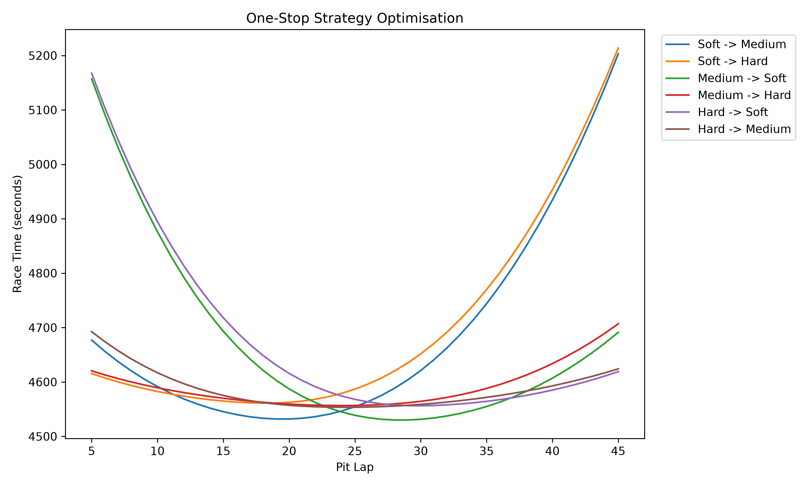
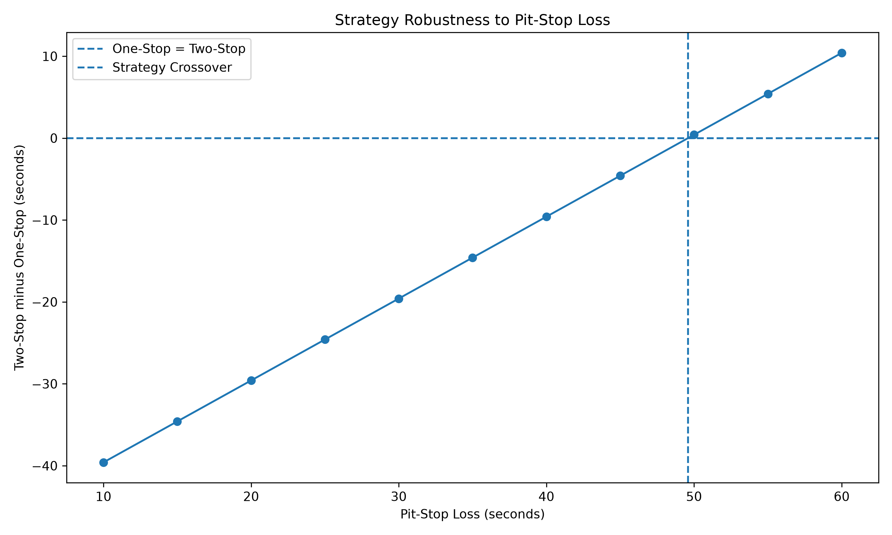
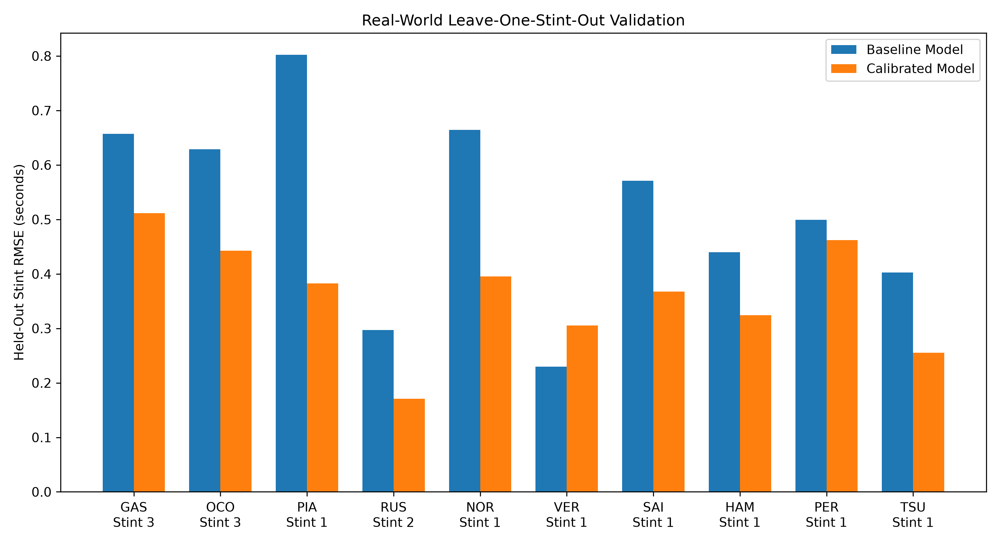
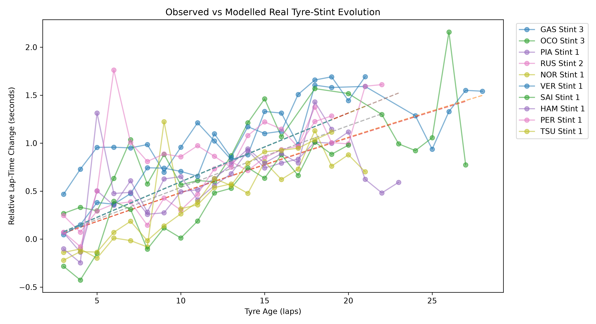
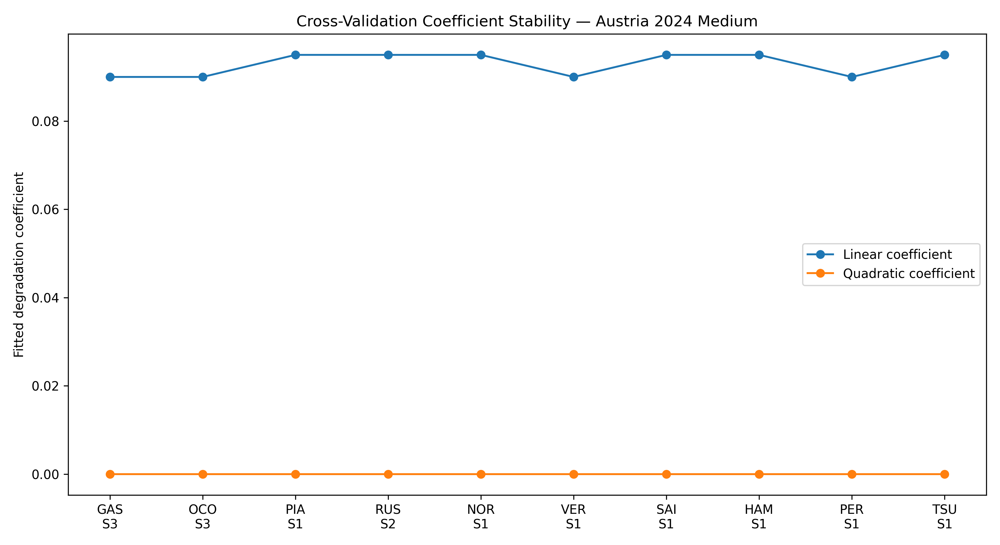

# Race Strategy & Performance Simulator

A Python motorsport simulation project investigating how tyre degradation, fuel load, pit-stop timing, Safety Cars and traffic affect race outcomes.

The project began as a simple deterministic tyre-degradation model and was progressively extended into a strategy-optimisation, uncertainty-analysis and real-data validation framework. It is intended as an engineering modelling and numerical-analysis project rather than a professional Formula 1 prediction tool.

## Headline Results

Reference run using the baseline model:

| Result | Value |
|---|---:|
| Race length | 50 laps |
| Best one-stop | Medium → Soft |
| One-stop pit | Lap 29 |
| One-stop time | 4530.065 s |
| Best two-stop | Medium → Soft → Soft |
| Two-stop pits | Laps 19 / 34 |
| Two-stop time | 4502.473 s |
| Two-stop advantage | **27.592 s** |
| Traffic-aware optimum | Lap 28 |
| Traffic-aware finish | P2 |
| One/two-stop pit-loss crossover | **49.59 s** |
| Monte Carlo runs | 1000 |

### Real-world tyre validation

Historical timing data from the **2024 Austrian Grand Prix** was processed using FastF1. Ten Medium-tyre stints were evaluated with leave-one-stint-out cross-validation.

| Validation metric | Result |
|---|---:|
| Baseline mean held-out RMSE | 0.5192 s/lap |
| Calibrated mean held-out RMSE | **0.3617 s/lap** |
| Mean held-out MAE | **0.2955 s/lap** |
| Held-out RMSE standard deviation | 0.1017 s/lap |
| Worst held-out RMSE | 0.5115 s/lap |
| Stints improved by calibration | **9 / 10** |
| Mean RMSE reduction | **30.3%** |
| Final fitted linear coefficient | 0.095 |
| Final fitted quadratic coefficient | 0.000 |

The key result is that real-data calibration reduced average held-out stint prediction RMSE by approximately **30%**. The cross-validation folds repeatedly drove the quadratic term toward zero, suggesting that the additional curvature originally assumed by the model was not supported by this particular dataset.

> **Important:** real-world validation assesses **relative lap-time evolution within tyre stints**, not absolute Formula 1 lap-time prediction. The complete simulator should not be interpreted as predicting F1 race pace to 0.36 seconds per lap.

## Project Objectives

The simulator was developed to investigate questions such as:

- When is the optimal lap to make a pit stop?
- When does a two-stop strategy outperform a one-stop strategy?
- How does tyre degradation change the optimum?
- How does a Safety Car affect pit-stop decisions?
- Can a theoretically faster strategy perform worse because of traffic?
- How sensitive is the recommended strategy to uncertain assumptions?
- Can tyre degradation parameters be calibrated from real stint data?

## Model

Green-flag lap time is represented conceptually as:

```text
Lap Time =
Base Pace
+ Tyre Degradation
+ Tyre Warm-Up Penalty
- Fuel Mass Benefit
+ Traffic Effects
```

The tyre model contains linear and quadratic degradation terms plus an optional late-stint cliff penalty. Fuel load affects both lap time and effective tyre wear. Pit stops reset tyre age and wear but introduce a time penalty.

Most baseline coefficients are **model assumptions**, not measured F1 parameters. The validation framework exists specifically to distinguish assumed behaviour from behaviour supported by data.

## Strategy Optimisation

The simulator performs exhaustive searches over permitted pit windows.

For a one-stop strategy, every permitted pit lap is tested. For a two-stop strategy, every permitted pair of pit laps is evaluated. Brute force was chosen because the search space is small enough to evaluate directly, it makes the optimum easy to verify, and it avoids unnecessary optimiser complexity.

Under the reference assumptions, the isolated optimum is a Medium → Soft one-stop on lap 29, while the fastest two-stop is Medium → Soft → Soft on laps 19 and 34.

The one-stop optimiser evaluates every permitted pit lap for each compound combination and selects the minimum simulated race time.




## Safety Car Uncertainty

Safety Cars are generated probabilistically and evaluated using Monte Carlo simulation.

The uncertainty-aware strategy does not assume perfect knowledge of the realised Safety Car ending when deciding whether to pit. It evaluates the possible remaining durations consistent with the current lap, then compares the expected race time of pitting immediately against staying on the original plan.

Using the reference 1000-simulation sample:

```text
One-stop fixed mean:              4568.236 s
One-stop uncertainty-aware mean:  4568.173 s
Two-stop fixed mean:              4543.072 s
Two-stop uncertainty-aware mean:  4542.701 s
```

The improvement is deliberately modest. The purpose is to demonstrate causal decision-making under uncertainty, not to manufacture a large gain.

## Multi-Car Traffic Model

A simplified six-car field adds:

- running order;
- pit rejoin position;
- dirty-air lap-time loss;
- a generic overtaking-aid model;
- simplified overtaking restrictions;
- track-position changes.

This changes the optimisation objective from pure isolated race time to race outcome. In the reference case, the isolated optimum is lap 29, while the traffic-aware field model prefers **lap 28**.

This demonstrates that the minimum isolated race time is not necessarily the best strategy when competitors and track position are included.

## Sensitivity Analysis

The simulator varies uncertain assumptions rather than presenting one optimum as universally correct. Current sensitivity studies include pit-stop loss and tyre degradation.

Under the reference model, the two-stop strategy remains quicker until assumed pit-stop loss reaches approximately **49.59 seconds**. This is a model result, not a real-world pit-loss threshold.

### Pit-Loss Sensitivity



Under the baseline model, the two-stop strategy remained faster until the assumed pit-stop loss increased to approximately **49.6 seconds**, demonstrating how the preferred strategy depends on pit-stop cost.

## Real-World Validation Method

The validation pipeline uses FastF1 timing data from the 2024 Austrian Grand Prix.

The cleaning stage excludes:

- race-start laps;
- pit in-laps;
- pit out-laps;
- non-green track-status laps;
- FastF1 observations marked inaccurate;
- early tyre warm-up observations;
- large local lap-time anomalies.

Only suitable fresh-tyre stints with enough clean observations are retained.

Different F1 cars do not share the same absolute performance level, so the validation does **not** fit one common base lap time across every driver. Instead, each stint is normalised to its first clean observation and the model predicts subsequent **relative lap-time change** through the stint.

### Leave-one-stint-out cross-validation

For each validation fold:

1. One entire tyre stint is removed.
2. Degradation coefficients are fitted using the remaining stints.
3. The fitted model predicts the unseen stint.
4. Held-out RMSE and MAE are recorded.

This is preferable to randomly splitting individual laps because neighbouring laps from the same tyre life are strongly related and a random split could leak information between training and validation.

### Real validation result

Across ten Medium-tyre stints:

```text
Mean baseline held-out RMSE:    0.5192 s/lap
Mean calibrated held-out RMSE:  0.3617 s/lap
Mean held-out MAE:              0.2955 s/lap
Improved held-out stints:       9 / 10
Mean RMSE reduction:            30.3%
```
### Held-Out Stint Validation



Calibration reduced mean held-out RMSE from **0.5192 s/lap to 0.3617 s/lap**, a **30.3% reduction**, with prediction error improving on **9 of 10 held-out Medium-tyre stints**.

One held-out stint became worse after calibration. That result is retained rather than hidden because a common degradation model cannot capture every driver/car/stint combination. Driver management, traffic, setup, track evolution, tyre temperature and other unmodelled effects remain in the observed timing data.

### Observed vs Modelled Stint Evolution



The comparison above shows relative lap-time evolution through the selected real Medium-tyre stints. Each stint is referenced relative to its own clean starting observation so that the validation focuses on tyre-stint evolution rather than differences in absolute car performance.

### Coefficient Stability



The fitted degradation coefficients across the leave-one-stint-out folds show how the calibration changes when each stint is excluded from training. The quadratic coefficient repeatedly reaches zero for this dataset.

## Development History

Before the project was packaged into this modular repository, it was developed locally through a series of standalone Python scripts. I have preserved **all 30 development snapshots** in [`development_history/`](development_history/) and documented the progression in [`DEVELOPMENT_HISTORY.md`](DEVELOPMENT_HISTORY.md).

The archive starts with a basic one-stop tyre model and shows the progression through two-stop optimisation, tyre/fuel modelling, Safety Car uncertainty, traffic and overtaking, sensitivity analysis, calibration, cross-validation and real-data validation. The files retain their original local filenames and are presented as pre-Git development snapshots, not retroactive commits.


## Repository Structure
```text
race-strategy-performance-simulator/
│
├── README.md
├── DEVELOPMENT_HISTORY.md
├── main.py
├── config.py
├── model.py
├── strategy.py
├── uncertainty.py
├── traffic.py
├── validation.py
├── requirements.txt
├── .gitignore
│
├── development_history/
│   ├── 01_core_strategy/
│   ├── 02_automatic_strategy_search/
│   ├── 03_tyre_model_development/
│   ├── 04_safety_car_and_uncertainty/
│   ├── 05_traffic_and_field_interaction/
│   └── 06_robustness_calibration_validation/
│
├── tests/
│   └── test_smoke.py
│
├── data/
│   ├── calibration_template.csv
│   └── README.md
│
├── results/
│   ├── reference_validation_results.txt
│   └── latest_simulator_results.txt
│
└── plots/
    ├── 01_strategy_optimisation.png
    ├── 02_monte_carlo.png
    ├── 03_field_strategy.png
    ├── 04_sensitivity.png
    ├── 05_real_cross_validation.png
    ├── 06_real_stint_validation.png
    └── 07_coefficient_stability.png
```

A live run with FastF1 generates `data/real_validation_clean_laps.csv` and `results/real_validation_results.txt`, and refreshes the real-validation plots. The cleaned lap-level CSV is generated locally and is not committed to the repository.

## Running the Project

Python 3.12 is recommended.

Install dependencies:

```bash
python -m pip install -r requirements.txt
```

Run the complete project, including FastF1 validation:

```bash
python main.py
```

Run the simulator without downloading real timing data:

```bash
python main.py --skip-real
```

Save plots without opening plot windows:

```bash
python main.py --no-show
```

Run the built-in smoke tests:

```bash
python -m unittest discover -s tests -v
```

FastF1 data is cached locally after the first successful download.

## Analysis Plots

The repository intentionally keeps the final presentation compact:

1. **Strategy optimisation** — exhaustive one-stop search.
2. **Monte Carlo outcomes** — strategy performance under Safety Car uncertainty.
3. **Traffic-aware field strategy** — final position against pit timing.
4. **Pit-loss sensitivity** — robustness and one/two-stop crossover.
5. **Real cross-validation** — baseline versus calibrated held-out RMSE.
6. **Real stint validation** — observed-versus-modelled relative tyre-stint evolution.
7. **Coefficient stability** — fitted degradation coefficients across real held-out stints.

## Limitations

The simulator deliberately simplifies real motorsport. Limitations include:

- illustrative baseline tyre coefficients;
- simplified fuel model;
- simplified Safety Car generation;
- simplified dirty-air and overtaking behaviour;
- no detailed tyre-temperature state;
- no circuit-specific passing zones;
- no detailed aerodynamic wake model;
- no weather model;
- no driver-error model;
- no car-specific setup or thermal model;
- validation on one event and one selected dry compound.

The real-data stage validates only a limited part of the physical model. Stronger generalisation evidence would require cross-event validation and richer operating-condition data.

## Engineering Conclusions

Several conclusions emerged from development:

- Exhaustive optimisation is sufficient when the strategy search space is small.
- The fastest isolated strategy can differ from the best traffic-aware strategy.
- Expected-optimal decisions under uncertainty can still lose in individual realised scenarios.
- Sensitivity analysis is necessary before treating an optimum as robust.
- Increasing model complexity is not automatically beneficial: the Austrian GP data repeatedly favoured a zero quadratic degradation term.
- Model calibration should be evaluated on unseen data rather than only by fit quality on the training sample.

## Future Work

Future work should be data-led rather than feature-led. The most valuable extensions would be:

- cross-event validation;
- circuit-specific degradation models;
- car- or driver-specific random effects;
- tyre temperature and track evolution where suitable data is available;
- more detailed traffic/overtaking modelling only if it can be validated.

## Skills Demonstrated

Python, engineering modelling, numerical simulation, exhaustive optimisation, Monte Carlo methods, sensitivity analysis, data preprocessing, model calibration, cross-validation, technical plotting, assumption management and engineering interpretation.
